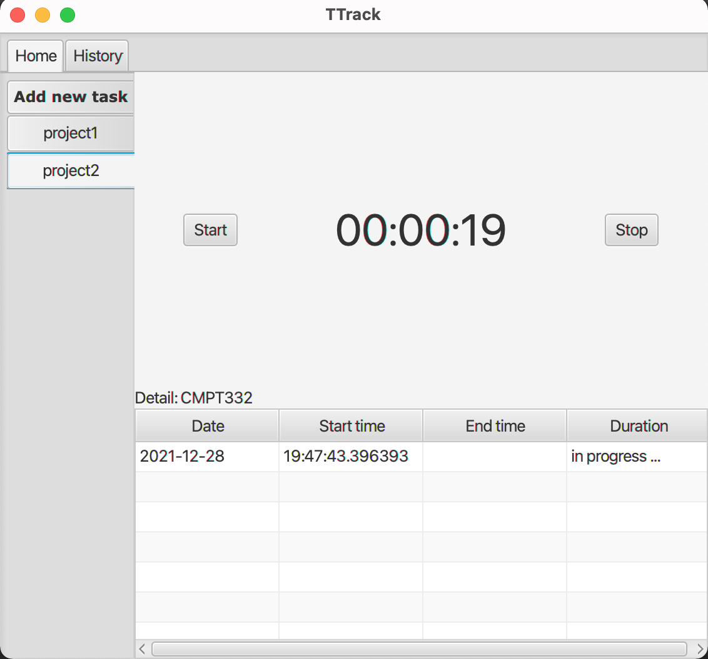
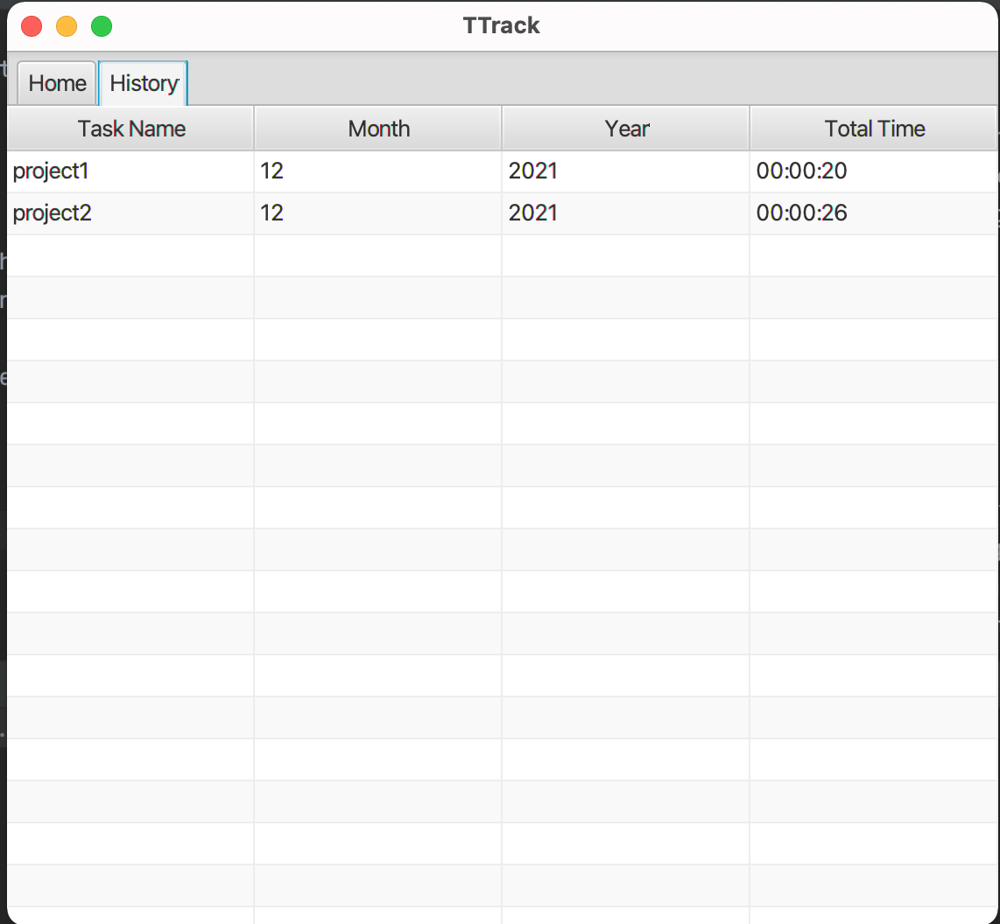

## Overview
Time-tracker application (called TTrack) lets users record the time they spend on a set of tasks, create new task to track, and see summaries of their time records. For this assignment, I was in charge of all production steps from designing (based on a given user persona and including ideation, sketching and evaluating) to implementation.

## Functionalities
* Add a new task: Choose the 'Add New Task' tab,  fill in the information and click 'Add' button
* Start a task: Choose the task you want to start working on, then click 'Start' button
* Stop a task: Choose the task you want to stop working on, then click 'Stop' button
* See the working-lap history of a task: The table below the time counter. Hover the cursor over the column title and click the black triangle for sorting
* See the monthly working time history of every task: Click the history tab. Hover the cursor over the column title and click the black triangle for sorting

## Technologies
* IntelliJ
* Java
* JavaFX
